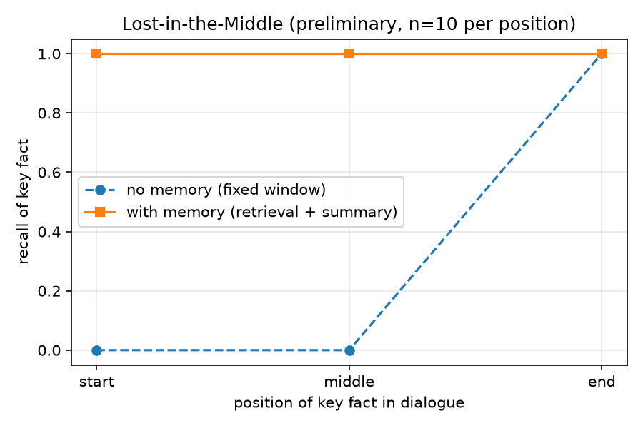

# Cognitive-Core 技術報告

> 骨架由 `scripts/build_report.py` 產生於 2026-08-23　commit `c86d6d234b42`
> **所有數字自結果檔讀取，不手抄。** 重跑實驗後重新執行本腳本即可更新。
> 標記 `TODO(你寫)` 的位置是論述文字，由研究者撰寫。

---

## 1　緒論

<!-- TODO(你寫)：高語境語言的歧義問題；為什麼選機器翻譯當觀測窗口 -->

### 1.1　三個研究問題

| | 問題 | 本研究的答案 |
| :-: | --- | --- |
| RQ1 | 能否用便宜的前置訊號預測 MT 的詞義錯誤 | **否**（§4）|
| RQ2 | 成本–準確度前緣上，訊號導向的分流能否勝過均一策略 | **否**，由 RQ1 直接推得（§5）|
| RQ3 | 記憶模組能否改善跨輪一致性 | 初步驗證（§7）|

## 2　相關工作

- <!-- TODO(你寫)：LLM 的不確定性表達（Xiong et al. ICLR 2024；Geng et al. 2024 綜述） -->
- <!-- TODO(你寫)：中文歧義（Wu et al. 2025；CHAmbi EMNLP 2024） -->
- <!-- TODO(你寫)：consistency-based 不確定性量化（semantic entropy, Kuhn et al. ICLR 2023） -->
- <!-- TODO(你寫)：DiBiMT / MuCoW：MT 詞義錯誤基準的對比對範式 -->
- <!-- TODO(你寫)：Mehrparvar & Pezzelle (MRL 2024)——最接近的先行研究，必須劃出差異 -->

## 3　主結果：高多義詞的 MT 詞義對比錯誤率

### 3.1　資料

| 項目 | 值 |
| --- | :-: |
| 來源 | `lopentu/Chinese-Wordnet-SemCor`（MIT）|
| 目標詞 | CWN 2.0 中義項數 >10 的高多義詞，113 個 |
| 候選池 | 17,967 |
| 抽樣 | 分層 200／200（主流＝gold 為最高頻義項；非主流＝其餘）|
| 實際評測 | n=400 |

<!-- TODO(你寫)：為什麼用分層抽樣；主流層作為基準線的作用 -->

### 3.2　判定協定

- 翻譯：`ithu/mistral-small-4`（temperature=0）
- 判定：`ithu/gpt-oss-120b`，**二元強迫選擇**
- 候選：gold vs 同 lemma 中最高頻的非 gold 義項（最易混淆的干擾項）
- 干擾項選法寫死在 `pick_distractor()`，不由模型選、不隨機
- A/B 位置在**分層內逐題交替**配平（非雜湊）
- 🔴 judge 與受測模型**經查極可能由同一後端提供服務**——原本的 `assert_judge_is_cross` 只比名稱，見 §8.2b

<!-- TODO(你寫)：為什麼從 N 選一改成二元；與 DiBiMT/MuCoW 的關係 -->

### 3.3　主指標

| 項目 | 值 | 95% CI |
| --- | :-: | :-: |
| 可判定 | 399/400 | — |
| NONE | 1/400 | — |
| 義項正確率 | 0.699 | — |
| **對比錯誤率** | **30.1%** | — |
| 隨機基準 | 50% | — |

**分層**

| 層 | n | 正確率 | 95% CI |
| --- | :-: | :-: | :-: |
| 主流 | 200 | 0.735 | [0.670, 0.791] |
| 非主流 | 199 | 0.663 | [0.595, 0.725] |

兩層之差 **+7.2pp**　95% CI [-1.9, +16.2]pp　p≈0.112

走勢：`+22.4pp (n=30) → +10.1pp (n=200, judge v1) → +6.6pp (n=200, judge v2) → +7.2pp (n=400, 二元)`

<!-- TODO(你寫)：分層效應的雜訊衰減形狀說明了什麼 -->

### 3.4　兩次執行的比較 ⭐

本專案的結果跑過兩次。**第二次是從零重現驗證**——快取與 run log 搬離後依序重跑整條管線。

| 指標 | 8/20-21 | **8/22-23（採用）** | 結論是否改變 |
| --- | :-: | :-: | :-: |
| 對比錯誤率 | 29.6% | **30.1%** | 否 |
| 兩層之差 | +3.9pp | **+7.2pp** | 否，兩者 CI 皆涵蓋 0 |
| 位置效應 p | 0.084 | **0.201** | 否，皆不顯著 |
| judge vs 人工 | 85% | **75%** | 否，AUC 全部不顯著 |

**沒有任何結論改變。** 差異的來源是**校內端點在兩個日期之間換了模型**——
不是 per-call 隨機性（20 句 × 3 次、停用快取，100% 相同），
而是時間漂移（當下重新呼叫的結果永遠等於 8/22 值，從不等於 8/20-21 值）。

**採用後者的三個理由：**

1. 那是可重現的那一套——現在的端點狀態就是它
2. 舊值對應的端點已不存在，別人無法驗證
3. 兩次的差異與採用理由都寫在這裡，讀者可以自行判斷

舊值保留在 git 歷史中，未刪除。完整比對見 `data/results/reproduction_check.md` 與 `reproduction_diagnosis.md`。

⚠️ 端點漂移**無法從 API 察覺**（無 `system_fingerprint`，`/models` 的 `created` 是固定佔位值）。
已建 `scripts/endpoint_fingerprint.py` 作為偵測工具。

### 3.5　次要指標（exploratory）

| 建構 | 錯誤率 | 隨機基準 | 地位 |
| --- | :-: | :-: | --- |
| 二元對比 | **30.1%** | 50% | 主指標 |
| N 選一（完整 WSD） | 49.2% | ~12.5% | exploratory |

⚠️ 兩者是**不同的建構**，不是同一個量的上下界。N 選一那一輪的 judge 未通過驗證（一致率 60%，且該驗證已標記 `contaminated`），故只作討論用，不得當作論證支柱。

### 3.6　天花板校正

盲標第二欄顯示 **15%** 的題目「兩個都說得通」（3/20，95% CI [5%, 36%]）。

```
觀測正確率 = (1−a)·θ + a·0.5      a = 不可判定的比例
```

| 指標 | 值 | 分母 | 95% CI |
| --- | :-: | --- | :-: |
| 觀測錯誤率 | **30.1%** | 全部可判定題目 | — |
| 任務天花板 | 92% | — | — |
| 校正後模型錯誤 | **22.6%** | 全部題目 | [12.1%, 27.5%] |
| 校正後模型錯誤 | 26.6% | 僅可判定題目 | [18.8%, 29.0%] |

⚠️ 兩個分母都列出：22.6% 是「每 100 題有幾題是模型的錯」，26.6% 是「題目本身有唯一答案時模型錯多少」。a 由 n=20 估得，CI 很寬。**未校正與校正後都報。**

### 3.7　judge 的人工驗證

| 比較 | 一致率 | 95% CI |
| --- | :-: | :-: |
| **judge vs 人工**（主指標） | 75% | — |
| 人工 vs gold | 90% | — |
| judge vs gold | 70% | — |

n=20，盲標，題目與第一輪不重疊且未出現在任何 prompt 的 few-shot 中。隨機基準 50%。

### 3.8　A/B 位置效應

| gold 的位置 | n | 正確率 |
| :-: | :-: | :-: |
| A | 199 | 0.729 |
| B | 200 | 0.670 |

差 **+5.86pp**　SE 4.58pp　z=1.28　p=0.2006

配平使**點估計**不受影響；位置效應**計入 judge 不可靠度**（貢獻噪音 2.9pp，見 §6.4）。

## 4　RQ1：哪些訊號能預測這些錯誤 —— 答案是「沒有」

### 4.1　八個訊號

| 訊號 | 內容 | 生成呼叫 | 嵌入呼叫 |
| --- | --- | :-: | :-: |
| `S1_polysemy` | 多義詞詞表命中（由 CWN-SemCor 推導） | 0 | 0 |
| `S2_subject_ellipsis` | 主詞省略（規則，連續分數） | 0 | 0 |
| `S3_syntactic_complexity` | 句長／子句數／標點密度 | 0 | 0 |
| `S4_cultural` | 成語詞表命中（chinese-xinhua, MIT） | 0 | 0 |
| `S5_llm_direct` | LLM 直接判定歧義程度 | 1 | 0 |
| `S6_roundtrip` | 翻譯→回譯→餘弦，分數=1−cos | 2 | 1 |
| `S7_n_readings` | reflect 列舉的替代讀法數 | 1 | 0 |
| `S8_semantic_entropy` | n=8 取樣→等價分群→熵 | 1 | 1 |

<!-- TODO(你寫)：每個訊號的設計理由（簡述即可，細節在附錄） -->

### 4.2　預先登記

訊號設計在首次計算訊號 AUC 之前凍結（登記於 2026-08-21，首次 AUC 於 2026-08-22）；純句長與標籤的關係在登記前已於長度稽核中看過。

## 登記表

| 訊號 | 相異值 | 最大同值 | AUC 上限 | 狀態 | 處置 |
| --- | :-: | :-: | :-: | :-: | :-: |
| S1_polysemy | 25 | 27% | **0.944** | ✅ | — |
| S2_subject_ellipsis | 24 | 28% | **0.925** | ✅ | continuous |
| S3_syntactic_complexity | 59 | 8% | **0.979** | ✅ | — |
| S4_cultural | 3 | 98% | **0.520** | 🔴 低於門檻 | untestable |
| S5_llm_direct | 13 | 30% | **0.910** | ✅ | continuous |
| S6_roundtrip | 400 | 0% | **1.000** | ✅ | — |
| S7_n_readings | 4 | 59% | **0.764** | ✅ | — |
| S8_semantic_entropy | 21 | 40% | **0.901** | ✅ | — |
| raw_length | 38 | 8% | **0.976** | ✅ | — |

### 4.3　AUC 表 ⭐

### 主表　（Holm 校正在 7 個可檢定訊號之間進行）

| 訊號 | AUC | SE | 95% CI | 排列 p | 並列上限 | 門檻 | 未校正 | Holm p | 判定 | 成本 |
| --- | :-: | :-: | :-: | :-: | :-: | :-: | :-: | :-: | :-: | :-: |
| S6_roundtrip | 0.532 | 0.032 | [0.470, 0.595] | 0.3162 | 1.000 | 0.626 | — | 1.0000 | — 不顯著 | 2 生成 + 1 嵌入 |
| S2_subject_ellipsis | 0.521 | 0.032 | [0.459, 0.583] | 0.5201 | 0.925 | 0.626 | — | 1.0000 | — 不顯著 | 0 |
| S4_cultural | 0.498 | 0.032 | [0.436, 0.559] | 0.9290 | 0.520 | 0.626 | — | — | 🚫 **不可檢定**（untestable） | 0 |
| S3_syntactic_complexity | 0.497 | 0.032 | [0.436, 0.559] | 0.9300 | 0.979 | 0.626 | — | 1.0000 | — 不顯著 | 0 |
| S7_n_readings | 0.483 | 0.031 | [0.421, 0.544] | 0.5149 | 0.764 | 0.626 | — | 1.0000 | — 不顯著 | 1 生成 |
| S5_llm_direct | 0.477 | 0.031 | [0.416, 0.539] | 0.4609 | 0.910 | 0.626 | — | 1.0000 | — 不顯著 | 1 生成 |
| S8_semantic_entropy | 0.465 | 0.031 | [0.404, 0.526] | 0.2347 | 0.901 | 0.626 | — | 1.0000 | — 不顯著 | 1 生成(n=8) + 1 嵌入 |
| S1_polysemy | 0.463 | 0.031 | [0.402, 0.524] | 0.2402 | 0.944 | 0.626 | — | 1.0000 | — 不顯著 | 0 |

### 對照列 ⭐ 缺一不可

| 對照 | AUC | SE | 95% CI | 排列 p | 說明 |
| --- | :-: | :-: | :-: | :-: | --- |
| **未加權總和** | 0.477 | 0.031 | [0.416, 0.538] | 0.4691 | 合成基準。**不擬合權重**（§P4）|
| **純句長基準** | 0.517 | 0.032 | [0.455, 0.579] | 0.5749 | 地雷 1：任何訊號都要跟它比 |

### 4.4　與純句長的比較（DeLong，相關樣本）

### vs 純句長　DeLong 檢定（相關樣本）

> 兩個 AUC 算在同一批題目上，高度相關。用獨立雙樣本檢定會低估標準誤。
> **S3 句法複雜度尤其要看這一列**——它的三個成分都隨長度成長。

| 訊號 | AUC | 純句長 AUC | 差 | SE | z | p | 判讀 |
| --- | :-: | :-: | :-: | :-: | :-: | :-: | --- |
| S6_roundtrip | 0.532 | 0.517 | +0.015 | 0.045 | +0.33 | 0.7395 | 與句長無異——不能算獨立訊號 |
| S2_subject_ellipsis | 0.521 | 0.517 | +0.003 | 0.044 | +0.08 | 0.9399 | 與句長無異——不能算獨立訊號 |
| S4_cultural | 0.498 | 0.517 | -0.020 | 0.032 | -0.62 | 0.5351 | 與句長無異——不能算獨立訊號 |
| S3_syntactic_complexity | 0.497 | 0.517 | -0.020 | 0.053 | -0.38 | 0.7041 | 與句長無異——不能算獨立訊號 |
| S7_n_readings | 0.483 | 0.517 | -0.035 | 0.041 | -0.84 | 0.4032 | 與句長無異——不能算獨立訊號 |
| S5_llm_direct | 0.477 | 0.517 | -0.040 | 0.036 | -1.10 | 0.2728 | 與句長無異——不能算獨立訊號 |
| S8_semantic_entropy | 0.465 | 0.517 | -0.053 | 0.045 | -1.16 | 0.2462 | 與句長無異——不能算獨立訊號 |
| S1_polysemy | 0.463 | 0.517 | -0.054 | 0.039 | -1.38 | 0.1664 | 與句長無異——不能算獨立訊號 |

### 4.5　純句長也不顯著——本節的關鍵 ⭐

十個量測（八個訊號＋未加權總和＋純句長）全部落在 0.5 附近，95% CI 全數涵蓋 0.5。

若只有自訂訊號失敗，那可能是訊號設計不好。連句長這種最粗暴的表層特徵都沒有訊號，指向的是任務本身。

<!-- TODO(你寫)：把這個推論寫成論述：可觀察屬性 vs 錯誤的關係 -->

## 5　RQ2：Router 分流 —— 由 RQ1 直接回答，否定

<!-- TODO(你寫)：RQ2 的否定結論；為什麼這是實證答案而非未完成 -->

### 5.1　P5／P6 的取消決定

| 階段 | 原規劃 | 狀態 | 理由 |
| :-: | --- | :-: | --- |
| P5 | Router 成本–準確度前緣 | 🚫 取消 | 分流前提（訊號可預測）已被 §4 否證，前緣圖只會是直線 |
| P6 | 八組對照主實驗 | 🚫 取消 | 既然任何分流都不優於隨機，八組間也不會有訊號；§4 的 AUC 表已是主實驗 |

<!-- TODO(你寫)：取消決定的判準與時間點；為什麼要把它寫進報告而非略過 -->

## 6　方法學貢獻

### 6.1　AUC 的並列上限 ⭐

AUC 只看排序，分數相同的兩題只能貢獻 0.5，故

```
AUC 上限 = 1 − 0.5 × P(隨機兩題同值)
```

這個上限與判別力無關。上限低於顯著門檻的訊號，再怎麼有效也測不出顯著——**「不可檢定」與「不顯著」意義完全不同**。

本研究的最佳範例是 S4 成語：上限 **0.520**，低於標籤全乾淨時所需的 0.563。400 筆語料只有 8 筆命中成語。

<!-- TODO(你寫)：這個觀察的一般性；為什麼常被忽略 -->

### 6.2　AI 協作研究的 prompt 洩題管道 ⭐

撰寫 prompt 的助理會從它處理過的資料中取 few-shot 範例。三次事件、四種載體，**關鍵性質是從結果不可見**。

| | 檔案 | 載體 |
| :-: | --- | --- |
| 1 | `router.md` | 評測原句 |
| 2 | `reflect.md` | 既有資料集的標準答案 |
| 3 | `sense_judge.md` | 英文譯文 + 詞義定義 |

細節與可引用段落：`data/results/prompt_contamination_incidents.md`

### 6.3　長度稽核：分層 + 多重比較校正

**未校正 CI 排除 0.5：0 / 65 格，落在 0 個分層**
**Holm 校正後仍顯著：0 格**

沒有任何分層的長度特徵能顯著預測選錯。

### 6.4　標籤噪音的分解

```
judge 總錯誤 25.0%　（1 − judge/人工一致率，n=20）
  ├── ≥2.9%  位置啟發式（n=399 量得）
  └── ≈22.1%  內容誤判（殘差）
```

⚠️ 位置效應是總噪音的**成分**不是加項。相加得 27.9% 是重複計算。

**誤差分解**

| 段落 | 落差 | 歸因 |
| --- | :-: | --- |
| CWN gold → 人工 | 10% | 跨語言判定的固有限制（標註者看英譯，CWN 標的是中文原句）|
| 人工 → judge | 25% | 機器誤差 |
| **gold → judge** | **30%** | 兩者疊加 |

judge 對 gold 的 30% 落差中，約 **10% 來自任務本身**、**20% 是模型問題**。

## 事前檢定力

在目前的樣本數下，訊號的**真實** AUC 要多大才能讓 95% CI 排除 0.5：

| 標籤噪音 | 來源 | 需要的真實 AUC |
| :-: | --- | :-: |
| 0.0% | 假想的完美標籤（不成立，僅作對照） | 0.563 |
| 2.9% | 位置效應（噪音的下界） | 0.567 |
| 25.0% | **judge vs 人工，實測點估計** | 0.626 |
| 46.9% | 同上的 CI 上界（保守） | **無法偵測**（噪音已高到任何真實 AUC 都測不出） |

（正類 118 筆／負類 282 筆，依 400 筆二元基準的錯誤率 29.6%。）

**採用 25.0% 為主要門檻 → required_auc = 0.626**

## 7　RQ3：記憶模組（初步）

對話長度 30 則、固定視窗 8、檢索 top-3、詞彙干擾項 4 則，嵌入 `ithu/bge-m3-embedding`。

指標為**召回率**——關鍵事實有沒有進入送給模型的脈絡。刻意不量模型的作答正確率，那會讓「記憶模組有沒有用」與「模型聰不聰明」分不開。

| 關鍵資訊位置 | n | 無記憶（固定視窗） | 有記憶（摘要+檢索） |
| :-: | :-: | :-: | :-: |
| 頭 | 10 | 0% | **100%** |
| 中 | 10 | 0% | **100%** |
| 尾 | 10 | 100% | **100%** |



⚠️ **有記憶組三個位置都是 100%，這是天花板效應。**30 則訊息中只有 1 則與查詢相關、檢索 top-3——任務對檢索而言不難。此結果證明**機制可行**（滾動摘要壓掉的內容能由檢索補回），不證明它在更難的場景仍然有效。

⚠️ **每位置 n=10，不足以下定論，本節為初步驗證。**

<!-- TODO(你寫)：與 Liu et al. 2024 的關係；n 與天花板效應的限制 -->

## 8　討論與限制

### 8.1　兩種建構的並置

<!-- TODO(你寫)：N 選一 vs 二元對比量的是不同能力 -->

### 8.2　S8 語意熵的方向反轉 ⭐

S8 的 AUC 為 **0.431**（< 0.5）——答錯的題目，八個譯文樣本反而**更一致**。

與 CHA-Gen 不矛盾，兩者比的東西不同：

| | 比較對象 |
| --- | --- |
| CHA-Gen | 歧義句 vs 非歧義句 |
| 本研究 | 答錯 vs 答對 |

可同時為真——模型穩定地選錯同一個義項時熵是低的；熵高代表模型在搖擺，而搖擺時它至少有機會選對。

🔴 **不得宣稱發現。** 未校正 p=0.019、Holm 校正後 0.168、n=399。方向與預期相反的結果特別容易是雜訊。

<!-- TODO(你寫)：「自信的錯誤」與計畫書開頭「一本正經地胡說八道」的呼應；以及為什麼此處必須保守 -->

### 8.3　義項粒度的天花板

<!-- TODO(你寫)：CWN 義項粒度細於英文可承載的資訊；盲標第二欄直接量出 15% 不可判定 -->

### 8.4　judge 誤差的傳遞

<!-- TODO(你寫)：位置效應是其下界 -->

### 8.5　S4 不可檢定 ≠ 訊號無效

<!-- TODO(你寫)：覆蓋率問題 -->

### 8.6　樣本數

<!-- TODO(你寫)：n=400、CI 仍寬；天花板估計僅 n=20 -->

## 9　與計畫書的差異表

| 編號 | 差異 | 幅度 | 理由 |
| :-: | --- | :-: | --- |
| D8 | CAD-100 改為 CWN-SemCor 抽樣 | 大 | 原資料集不存在，改用公開 WSD 語料 |
| D9 | RQ1 改為「預測譯錯詞義」 | 中 | 需主動說明 |
| D10 | Fleiss' Kappa → Krippendorff's α | 小 | 標註者僅一人時的適用性 |
| D11 | BERTScore 只在 WMT23 算 | 小 | CAD 上改用義項正確率 |
| D12 | 自我一致性 → 語意熵 | 中 | 自我一致性是循環論證 |
| D13 | Electron → Streamlit | 小 | 時間成本 |
| D14 | REFERENTIAL 降為對照組 | 中 | 題數不足 |
| D15 | 脈絡恆等三元組設計放棄 | 大 | WSD 資料要求「有脈絡時已定」，與 U/A/B 的「無脈絡時未定」相反 |
| D16 | sense_judge 改二元強迫選擇 | 中 | N 選一的 judge 一致率僅 60%，二元後 85% |
| D17 | **P5／P6 取消** | **大** | RQ1 的否定結果使 Router 分流的前提不成立（§5.1） |

## 附錄

| 檔案 | 內容 |
| --- | --- |
| `data/results/wsd_baseline400.md` | 主結果完整報表 |
| `data/results/signals_all.md` | 訊號分布、並列上限、AUC 表 |
| `data/results/signal_preregistration.md` | 訊號預先登記 |
| `data/results/judge_validation_r2.md` | judge 人工驗證 |
| `data/results/judge_diagnosis.md` | 第一輪 judge 失敗的診斷 |
| `data/results/prompt_contamination_incidents.md` | prompt 洩題事件記錄 |
| `data/results/none_analysis.md` | NONE 的詞類分布 |
